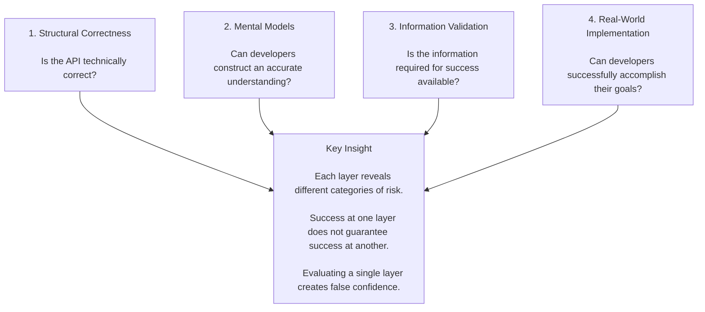

# Evaluating API Developer Experience

Developer experience isn't defined by whether an API works.
It's defined by whether developers can successfully achieve their goals with it.

An API can be technically correct and still fail developers.

Developers can understand what an API is and still lack information required to use it effectively.

Information can be available and implementation can still expose challenges that were not visible during review.

Over years reviewing public APIs, writing and evaluating documentation, building test implementations, and designing evaluation systems, I repeatedly encountered the same pattern:

- Teams focused on whether an API was correct.

- Developers cared whether they could successfully use it.

Those are not the same thing.

This framework emerged from an effort to answer a simple question:

> How can we determine whether developers will succeed?

## The Framework

Developer experience issues emerge across multiple layers:

## Where This Comes From

This framework emerged from years of evaluating APIs from the perspective of developer success.

When I joined Wix, there was no formal developer experience review process. Most developer experience issues surfaced during documentation review, after the API had already been designed and implemented.

I focused on identifying developer experience issues earlier in the design process, when recommendations could still influence the API itself.
Developer experience review eventually became a required stage of the API publication process, bringing developer experience considerations much earlier, into API design.

During that time, I reviewed hundreds of APIs across a wide range of platform domains, validated documentation, trained reviewers, developed review guidelines, built test implementations, and later helped design AI-assisted review systems.

Across all of this work, the same categories of developer experience issues appeared repeatedly across different products, teams, and implementation scenarios.

Some issues were visible during API review.

Others appeared only when validating documentation.

Others emerged only when attempting to build a realistic implementation.

The framework is an attempt to organize those observations into a model that explains where different types of developer experience risks appear and how they can be identified.

## Applying the Framework

The remainder of this portfolio explores the framework through real examples.

Each example focuses on a different category of developer experience risk, from platform understanding and capability selection to information validation, implementation challenges, and scalable review systems.

Taken together, they show that developer success depends on a chain of decisions, assumptions, information, and implementation details, and that failures can emerge at any point along that path.
