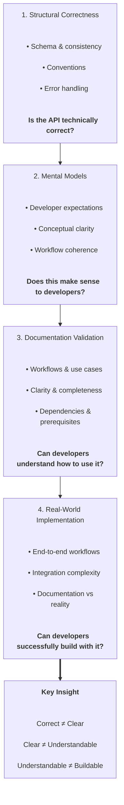

# Evaluating API Developer Experience

Developer experience isn't defined by whether an API works.

It's defined by whether developers can successfully achieve their goals with it.

An API can be technically correct and still fail developers.

Over seven years reviewing public APIs, validating documentation, building test implementations, and designing evaluation systems, I repeatedly encountered the same pattern:

Teams focused on whether an API was correct.

Developers cared whether they could successfully use it.

Those are not the same thing.

This framework emerged from an effort to answer a simple question:

> How can we determine whether developers will succeed?

---

## The Problem

Most API reviews focus on the API itself.

Questions such as:

* Is the schema consistent?
* Are resources modeled correctly?
* Are validation rules enforced?
* Does the API follow established conventions?

These questions matter.

But they only evaluate one layer of developer experience.

They do not answer questions such as:

* Will developers understand how this fits into their workflow?
* Can they determine which APIs they need?
* Can they accomplish their goals using the documented capabilities?

Developer success depends on more than correctness.

---

## The Framework

Developer experience issues emerge across multiple layers.

---

## Key Insight

Each layer answers a different question:

* Is the API correct?
* Is it clear what the API does?
* Can developers understand how to use it?
* Can developers successfully build with it?

---

## Where This Comes From

This framework is based on:

* Hundreds of API design reviews
* Documentation strategy and validation work
* Implementation-based API evaluation
* Reviewer training and evaluation processes
* AI-assisted API review systems

It is not intended as a theoretical model.

It's a synthesis of recurring patterns observed while evaluating whether developers could successfully use real APIs.

---

## Applying the Framework

The remainder of this portfolio contains examples of how this framework was applied in practice.

Examples include:

* API usability evaluations
* Documentation validation exercises
* Real-world implementation findings
* Evaluation systems designed to scale developer experience review

Together, these examples illustrate how different layers of the framework expose different categories of developer experience issues.
