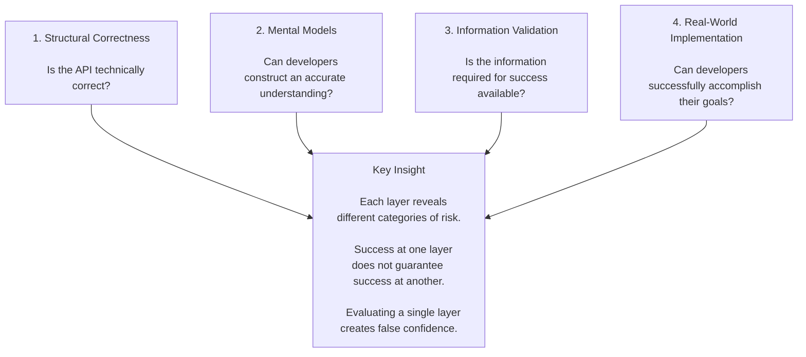

# Evaluating API Developer Experience

Developer experience isn't defined by whether an API works.

It's defined by whether developers can successfully achieve their goals with it.

An API can be technically correct and still fail developers.

Developers can understand what an API is and still lack information required to use it effectively.

Information can be available and implementation can still expose challenges that were not visible during review.

Over years reviewing public APIs, validating documentation, building test implementations, and designing evaluation systems, I repeatedly encountered the same pattern:

Teams focused on whether an API was correct.

Developers cared whether they could successfully use it.

Those are not the same thing.

This framework emerged from an effort to answer a simple question:

> How can we determine whether developers will succeed?

## The Problem

Most API reviews focus on the API itself.

Questions such as:

* Is the schema consistent?
* Are resources modeled correctly?
* Are validation rules enforced?
* Does the API follow established conventions?

These questions matter.

But they only evaluate one layer of developer experience.

They do not answer questions such as:

* Will developers understand how this fits into their workflow?
* Can they determine which APIs they need?
* Can they accomplish their goals using the documented capabilities?

Developer success depends on more than correctness.

## The Framework

Developer experience issues emerge across multiple layers.

## Key Insight

Each layer evaluates a different category of developer risk.

Success at one layer does not guarantee success at the next.

An API can be technically correct while still creating confusion.

Developers can understand what an API is while lacking information required to use it effectively.

Information can be available while implementation exposes challenges that were not visible during review.

Evaluating only a single layer creates false confidence.

## Where This Comes From

This framework emerged from years of evaluating APIs from the perspective of developer success.

During that time, I reviewed hundreds of APIs across multiple platform domains, validated documentation, built test implementations, trained reviewers, developed review guidelines, and later helped design AI-assisted review systems.

The framework did not emerge from a single review process or initiative.

It emerged from repeatedly observing the same categories of developer experience issues across different products, teams, and implementation scenarios.

Some issues were visible during API review.

Others appeared only when validating documentation.

Others emerged only when attempting a realistic implementation.

The framework is an attempt to organize those observations into a model that explains where different types of developer experience risks appear and how they can be identified.

## Applying the Framework

## Applying the Framework

The remainder of this portfolio explores the framework through real examples.

Each example focuses on a different category of developer experience risk, from platform understanding and capability selection to information validation, implementation challenges, and scalable review systems.

Taken together, they show that developer success depends on a chain of decisions, assumptions, information, and implementation details, and that failures can emerge at any point along that path.
