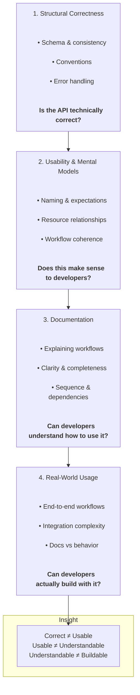

# Evaluating API Developer Experience

Developer experience is not defined by whether an API works.

It’s defined by whether developers can successfully use it without unnecessary friction.

APIs that are technically correct still fail developers every day.

Traditional API reviews focus on correctness: schemas, validation, and consistency.
But correctness alone does not guarantee usability, clarity, or successful integration.

Here I introduce a practical framework for evaluating **API Developer Experience (DX)** across four layers:

* Structural Correctness
* Usability
* Documentation
* Real-World Usage

---

## The Problem

Traditional API reviews (even thorough ones) tend to answer:

> *“Is this API correct?”*

But they often miss more important questions:

* Does this make sense to a developer encountering it for the first time?
* Can someone understand how to actually use it from the documentation?
* Can it support a real integration without friction?

---

## The Framework

API DX issues don’t exist at a single level. They emerge across layers:

---

## Key Insight

Each layer filters different types of problems:

* An API can be **correct but confusing**
* It can be **usable but difficult to explain**
* It can be **well-documented but fail in real-world usage**

---

## Where This Comes From

This framework is based on my hands-on work across:

* API design reviews covering a large portion of Wix's APIs since 2019
* Documentation strategy
* Developer tooling and AI-assisted review systems
* Design partner feedback loops

It reflects patterns observed across real APIs, not a theoretical model.

---

## How to Use This Framework

This framework is useful for:

* API design reviews
* DX evaluations
* Documentation planning
* Identifying gaps in developer onboarding

---

## Related Work

* [From Syntax Checker to Critical Reviewer: How We Convinced AI to Catch Real Quality Issues](https://medium.com/@alizaryeh/from-syntax-checker-to-critical-reviewer-how-we-convinced-ai-to-catch-real-api-quality-issues-965986af786b)
* [AI Project Leadership: When "Not Technical Enough" Became My Superpower](https://medium.com/@alizaryeh/ai-project-leadership-when-not-technical-enough-became-my-superpower-4c564573d267)
* [Unleashing Your API's Potential: How Strategic Documentation Drives Success](https://medium.com/wix-engineering/unleashing-your-apis-potential-how-strategic-documentation-drives-success-5aa84bf29793)

---
